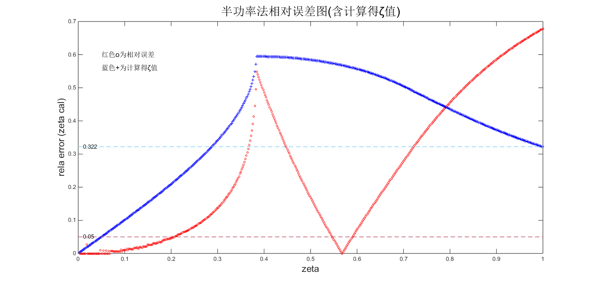

#振动力学程序作业-20161030
1. 绘制幅频特性曲线
1.  “半功率法”计算ζ
1.  绘制相频曲线

##Student Info
* 姓名：徐远方
* 学号：

##1.绘制幅频特性曲线
###Code-MATLAB(Plot4BetaLambda.m)
    %@author: xuyuanfang
    clear
    clc
    
    for zeta = 0:0.2:1
        lambda = 0:0.05:3;
        beta = 1./sqrt((1 - lambda.^2).^2 + (2*zeta*lambda).^2);
        plot(lambda, beta)
        text(1.1, 1/sqrt((1 - 1.1^2)^2 + (2*zeta*1.1)^2), num2str(zeta));
        hold on;
    end
    
    plot([1,1], [0,5], '--')
    axis([0 3 0 5])
    title('幅频特性曲线')
    xlabel('lambda')
    ylabel('beta')

###Figure

##2.“半功率法”计算ζ
###Code-MATLAB(Cal4Zeta.m)
    %@author: xuyuanfang
    clear 
    clc
    
    for zeta = 0.002:0.002:1;
        lambda = 0:0.001:3;%3001
        beta = 1./sqrt((1 - lambda.^2).^2 + (2*zeta*lambda).^2);
        Q = max(beta(:));
        Q_divsqrt2 = Q/sqrt(2);
        num_beta = find(beta==Q);
    
        div1_beta = beta(1:num_beta);
        div1_lambda = lambda(1:num_beta);
        div2_beta = beta(num_beta:3001);
        div2_lambda = lambda(num_beta:3001);
    
        div1_min_beta = min(abs(div1_beta - Q_divsqrt2));
        div1_num_beta = find(abs(div1_beta - Q_divsqrt2)==div1_min_beta);
        div1_rele_lambda = div1_lambda(div1_num_beta);
    
        div2_min_beta = min(abs(div2_beta - Q_divsqrt2));
        div2_num_beta = find(abs(div2_beta - Q_divsqrt2)==div2_min_beta);
        div2_rele_lambda = div2_lambda(div2_num_beta);
    
        delta_lambda = div2_rele_lambda - div1_rele_lambda;
        zeta_cal = 1/2*delta_lambda;
        rela_error = abs(zeta_cal - zeta)/zeta;
        plot(zeta, rela_error, 'o', 'MarkerSize', 3, 'MarkerEdgeColor', 'r')
        plot(zeta, zeta_cal, '+', 'MarkerSize', 5, 'MarkerEdgeColor', 'b')
        hold on;
    end
    
    text(0.1, 0.6, '红色o为半功率法相对误差');
    text(0.1, 0.56, '蓝色+为计算得ζ值');
    plot([0,1], [zeta_cal, zeta_cal], '--')
    plot([0,1], [0.05, 0.05], '--')
    title('半功率法相对误差图(含计算得ζ值)')
    xlabel('zeta')
    ylabel('rela error')

###Figure

###Conclusion
由上面的“半功率法相对误差图”可知，在满足工程允许误差小于5%的前提条件下，“半功率法”的适用范围为当ζ小于0.2时的情况。当ζ大于0.2后，由“半功率法”求得的ζ‘的相对误差越来越大，不再满足工程要求。
######补充说明
对于上图中ζ在0.5-0.6之间的相对误差小于5%的那部分，应该不予采纳。因为ζ从接近0.3开始，由“半功率法”所计算得到的ζ‘不再与真实的ζ一一对应，不能准确反映实际情况，故舍弃这一区段的ζ值。

##3.绘制相频曲线
###Code-MATLAB(Plot4ThetaLambda.m)
    %@author: xuyuanfang
    clear
    clc
    
    for zeta = 0.2:0.2:1
        lambda = 0:0.01:3;
        theta = atan(2*zeta*lambda./(1 - lambda.^2)).*180./pi;
        for i = 1:length(theta)
            if theta(i) < 0
                theta(i) = theta(i) + 180;
            end
        end
        plot(lambda, theta)
        text(1.5, 180 + atan(2*zeta*1.5/(1 - 1.5^2)).*180./pi, num2str(zeta));
        hold on
    end
    
    plot([1,1], [0,180], '--')
    title('相频曲线')
    xlabel('lambda')
    ylabel('theta')

###Figure

