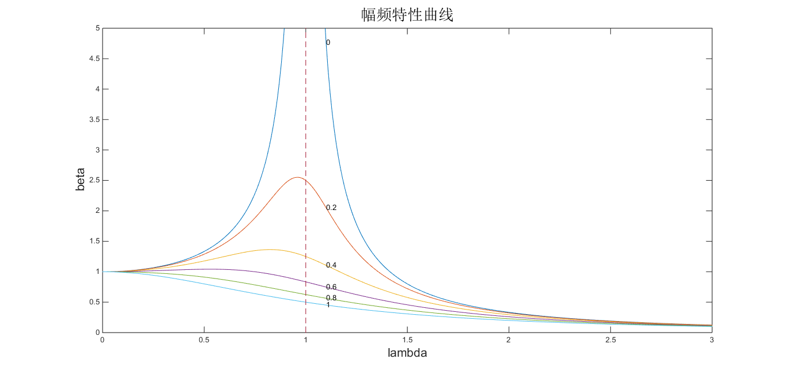
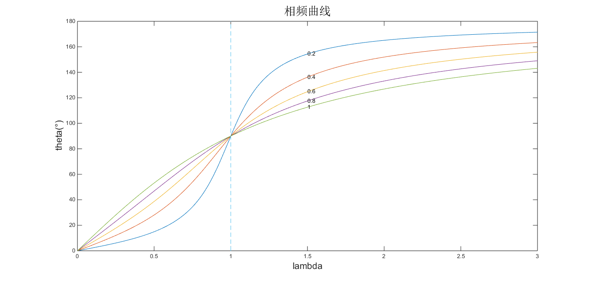

# 振动力学程序作业-20161030
1. 绘制幅频特性曲线
1.  “半功率法”计算ζ
1.  绘制相频曲线

## Student Info
* 姓名：徐远方
* 学号：

## 1.绘制幅频特性曲线
### Code-MATLAB(Plot4BetaLambda.m)
    % @author: xuyuanfang
    clear
    clc
    
    for zeta = 0:0.2:1
        lambda = 0:0.01:3;
        beta = 1./sqrt((1 - lambda.^2).^2 + (2*zeta*lambda).^2);
        plot(lambda, beta)
        text(1.1, 1/sqrt((1 - 1.1^2)^2 + (2*zeta*1.1)^2), num2str(zeta));
        hold on;
    end
    
    plot([1,1], [0,5], '--')
    axis([0 3 0 5])
    title('幅频特性曲线', 'FontSize', 20)
    xlabel('lambda', 'FontSize', 16)
    ylabel('beta', 'FontSize', 16)

### Figure

## 2.“半功率法”计算ζ
### Code-MATLAB(Cal4Zeta.m)
    % @author: xuyuanfang
    clear 
    clc
    
    for zeta = 0.002:0.002:1;
        lambda = 0:0.001:3; % 3001
        beta = 1./sqrt((1 - lambda.^2).^2 + (2*zeta*lambda).^2);
        Q = max(beta(:));
        Q_divsqrt2 = Q/sqrt(2);
        num_beta = find(beta==Q);
    
        div1_beta = beta(1:num_beta);
        div1_lambda = lambda(1:num_beta);
        div2_beta = beta(num_beta:3001);
        div2_lambda = lambda(num_beta:3001);
    
        div1_min_beta = min(abs(div1_beta - Q_divsqrt2));
        div1_num_beta = find(abs(div1_beta - Q_divsqrt2)==div1_min_beta);
        div1_rele_lambda = div1_lambda(div1_num_beta);
    
        div2_min_beta = min(abs(div2_beta - Q_divsqrt2));
        div2_num_beta = find(abs(div2_beta - Q_divsqrt2)==div2_min_beta);
        div2_rele_lambda = div2_lambda(div2_num_beta);
    
        delta_lambda = div2_rele_lambda - div1_rele_lambda;
        zeta_cal = 1/2*delta_lambda;
        rela_error = abs(zeta_cal - zeta)/zeta;
        plot(zeta, rela_error, 'o', 'MarkerSize', 3, 'MarkerEdgeColor', 'r')
        plot(zeta, zeta_cal, '+', 'MarkerSize', 5, 'MarkerEdgeColor', 'b')
        hold on;
    
        if rem(zeta/0.002, 25) == 0
            fprintf('%s%.4f%s%.4f%s%.4f%s\n','|',zeta,'|',zeta_cal,'|',100*rela_error,'|');
        end
    end
    
    text(0.01, zeta_cal, num2str(zeta_cal));
    text(0.01, 0.05, '0.05');
    text(0.05, 0.6, '红色o为相对误差', 'FontSize', 12);
    text(0.05, 0.56, '蓝色+为计算得ζ值', 'FontSize', 12);
    plot([0,1], [zeta_cal, zeta_cal], '--')
    plot([0,1], [0.05, 0.05], '--')
    title('半功率法相对误差图(含计算得ζ值)', 'FontSize', 20)
    xlabel('zeta', 'FontSize', 16)
    ylabel('rela error (zeta cal)', 'FontSize', 16)

### Output
###### 计算结果部分采样输出
| zeta | zeta_cal | rela_error (%) |
| :------- | :-------| :-------|
| 0.0500 | 0.0500 | 0.0000 |
| 0.1000 | 0.1010 | 1.0000 |
| 0.1500 | 0.1540 | 2.6667 |
| 0.2000 | 0.2090 | 4.5000 |
| 0.2500 | 0.2705 | 8.2000 |
| 0.3000 | 0.3410 | 13.6667 |
| 0.3500 | 0.4365 | 24.7143 |
| 0.4000 | 0.5945 | 48.6250 |
| 0.4500 | 0.5915 | 31.4444 |
| 0.5000 | 0.5845 | 16.9000 |
| 0.5500 | 0.5730 | 4.1818 |
| 0.6000 | 0.5570 | 7.1667 |
| 0.6500 | 0.5345 | 17.7692 |
| 0.7000 | 0.5050 | 27.8571 |
| 0.7500 | 0.4700 | 37.3333 |
| 0.8000 | 0.4355 | 45.5625 |
| 0.8500 | 0.4030 | 52.5882 |
| 0.9000 | 0.3730 | 58.5556 |
| 0.9500 | 0.3460 | 63.5789 |
| 1.0000 | 0.3220 | 67.8000 |

### Figure

### Conclusion
由上面的“半功率法相对误差图”可知，在满足工程允许误差小于5%（即0.05）的前提条件下，“半功率法”的适用范围为当ζ小于0.2时的情况。当ζ大于0.2后，由“半功率法”求得的ζ的相对误差越来越大，不再满足工程要求。
###### 补充说明
对于上图中ζ在0.5-0.6之间的相对误差小于5%的那部分，应该不予采纳。因为ζ从接近0.3开始，逐渐增大到1的过程中，由“半功率法”所计算得到的ζ不再与真实的ζ一一对应，不能准确反映实际情况，故舍弃这一区段的ζ值。

## 3.绘制相频曲线
### Code-MATLAB(Plot4ThetaLambda.m)
    % @author: xuyuanfang
    clear
    clc
    
    for zeta = 0.2:0.2:1
        lambda = 0:0.01:3;
        theta = atan(2*zeta*lambda./(1 - lambda.^2)).*180./pi;
        for i = 1:length(theta)
            if theta(i) < 0
                theta(i) = theta(i) + 180;
            end
        end
        plot(lambda, theta)
        text(1.5, 180 + atan(2*zeta*1.5/(1 - 1.5^2)).*180./pi, num2str(zeta));
        hold on
    end
    
    plot([1,1], [0,180], '--')
    title('相频曲线', 'FontSize', 20)
    xlabel('lambda', 'FontSize', 16)
    ylabel('theta(°)', 'FontSize', 16)

### Figure

----
###### 本文由Markdown编排，图片使用的png格式，图片清晰度不及LaTex使用的pdf图片格式，故将此次作业的电子版二维码置于下方。

### 电子版地址 https://github.com/xuyuanfang/mechanics_of_vibration